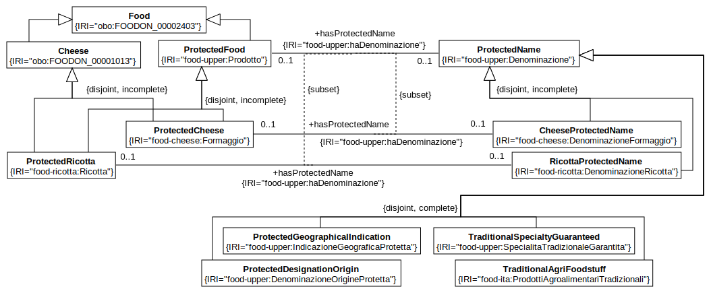

# Cheese Ontology

## Allineamenti con altre ontologie

L'ontologia è stata realizzata partendo da altre ontologie rappresentate in tabella.
Le più rilevanti sono `geonames` per utilizzare nomi di luoghi geografici; `foodon` e `agrovoc` per quanto riguarda il cibo.
L'ontologia `envo` è stata utilizzata per gli ambienti in cui sono realizzati i formaggi.
Infine, è stata utilizzata l'ontologia realizzata dal ministero Italiano per la definizione delle certificazioni.

```{=latex}
\begin{table}[H]
    \centering
    \begin{tabularx}{\textwidth}{|p{0.15\textwidth}|X|}
    \hline
    \textbf{Prefisso} & \textbf{Namespace}  \\ \hline
    %
    geo & \texttt{http://www.geonames.org/ontology\#} \\ \hline
    obo & \texttt{http://purl.obolibrary.org/obo/} \\ \hline
    owl & \texttt{http://www.w3.org/2002/07/owl\#} \\ \hline
    rdf & \texttt{http://www.w3.org/1999/02/22-rdf-syntax-ns\#} \\ \hline
    xml & \texttt{http://www.w3.org/XML/1998/namespace} \\ \hline
    xsd & \texttt{http://www.w3.org/2001/XMLSchema\#} \\ \hline
    rdfs & \texttt{http://www.w3.org/2000/01/rdf-schema\#} \\ \hline
    agrovoc & \texttt{http://aims.fao.org/aos/agrovoc/} \\ \hline
    food-ita & \texttt{http://w3id.org/food/ontology/denominazione-italiana/} \\ \hline
    food-upper & \texttt{http://w3id.org/food/ontology/disciplinare-upper/} \\ \hline
    food-cheese & \texttt{http://w3id.org/food/ontology/disciplinare-formaggio/} \\ \hline
    food-ricotta & \texttt{http://w3id.org/food/ontology/disciplinare-ricotta/} \\ \hline
 \end{tabularx}
 \caption{Prefissi e namespace utilizzati all'interno dell'ontologia.}
 \label{tab:prefix}
\end{table}
```

## Panoramica

L'ontologia modella i concetti principali che ruotano attorno al contesto dei formaggi.
È stato modellato il concetto di formaggio identificato come cibo (definito da `foodon`), facendo distinzione tra i formaggi freschi e stagionati.
La classe `RawMaterial` esprime il concetto di materia prima come ingrediante per la realizzazione del formaggio.
Un formaggio può avere due tipi di invecchiamento: maturazione e stagionatura.
Per quanto riguarda il processo di stagionatura è prevista la distizione tra formaggi stagionati in cella, in fossa o in grotta; tali ambienti sono rappresentati dal concetto di `Environment` definito dall'ontologia `envo`.
Infine è stato modellato il meccanismo delle certificazioni associate a formaggi e tipologie di latte impiegato nella relaizzazione del formaggio stesso.

In [figura](#fig:overview) sono rappresentati i concetti appena illustrati e le loro principali relazioni.

{witdh=100% #fig:overview}

```{=latex}
\begin{table}[H]
    \centering
    \begin{tabularx}{\textwidth}{|X|X|}
    \hline
    \textbf{Concetto} & \textbf{Definizione}  \\ \hline
    %
    Cheese & ...            \\ \hline
    Food & ...              \\ \hline
 \end{tabularx}
\end{table}
```

In tabella vengono sintetizzate le metriche relative alla `cheese-ontology`.
```{=latex}
\begin{table}[H]
    \centering
    \begin{tabularx}{\textwidth}{|X|X|}
    \hline
    Axiom & 459  \\ \hline
    Logical axiom count & 214 \\ \hline
    Declaration axioms count & 149 \\ \hline
    Class count & 74  \\ \hline
    Object property count &  23  \\ \hline
    Data property count & 2  \\ \hline
    Individual count & 49  \\ \hline
    Annotation Property count & 4\\ \hline
 \end{tabularx}
 \caption{Metriche relative all'ontologia.}
 \label{tab:metrics}
\end{table}
```

## Cheese
<!-- Linda -->
Per rappresentare il concetto di formaggio è stata utilizzata la classe `Cheese` sottoclasse di `Food` ed entrambe fanno parte dell'ontologia `foodon`.
A sua volta  `Cheese` generalizza le classi
 `CowCheese`, `SheepCheese`, `GoatCheese`, `BuffaloCheese` e `MixedMilkCheese` ed essi possono essere prodotti dal corrisponendente tipo di latte.
 Inoltre, sono state individuate le sottoclassi  `StretchedCurdCheese` e  `CreamCheese` per diversificare le tipologie di formaggio.
E' stata fatta un'ulteriore distinzione tra formaggio fresco e formaggio stagionato, rispettivamente con le classi  `FreshCheese` e  `AgedCheese`.
 Ogni tipologia di formaggio può essere composta da un certo tipo pasta (indentificata in questo caso dalla classe  `CheeseTexture`) e può essere solamente indicata dalle classi: `SoftCheese`  `SemiSoftCheese`  `Cheese`  `MediumHardCheese`  `HardCheese`.
 Queste ultime fanno parte di `foodon` eccetto per la classe `MediumHardCheese` che è stata aggiunta nella _cheese ontology_.
 Se un formaggio è indicato come `AgedCheese`, allora ha una certa durata di stagionatura ed è rappresentata dalla classe `Aging` che è a sua volta sottoclasse di `Event`.
Un'altra sottoclasse di `Event` è `Ripening` e si riferisce alla maturazione del formaggio.
È possibile specificare la provenienza di un formaggio definendo una `GeographicalFeature` dell'ontologia `geonames`.
Di seguito vengono riportate le object property relative alla classe `Cheese`.

```{=latex}
\begin{table}[H]
    \centering
    \begin{tabularx}{\textwidth}{|X|X|X|X|}
    \hline
    \textbf{ObjectProperty} & \textbf{Domain} & \textbf{Range} &\textbf{Inverse Of}  \\ \hline
    hasTexture & Cheese & CheeseTexture & isTextureOf \\ \hline
    hasAging & Cheese & Aging & isAgingOf \\ \hline
    hasRipening & Cheese & Ripening & isRipeningOf \\ \hline
    producedIn & Food & GeographicalFeature & isProductionPlaceOf \\ \hline
 \end{tabularx}
 \caption{\texttt{ObjectProperty} relative al concetto di formaggio.}
 \label{tab:milk}
\end{table}
```
La _object property_ `hasTexture` permette di definire qual è la tipologia di pasta che compone il formaggio e, infatti, ha come range `Cheese` e mentre come domain `CheeseTexture`. 
Inoltre, `hasAging` e `hasRipening`, che fanno in modo che si possano specificare rispettivamente tempo di stagionatura e di maturazione, hanno come domani `Cheese` e come range rispettivamente `Aging` e `Ripening`.
Infine, la _object property_ `producedIn` ha come domain `Food` e dunque può essere utilizzata anche dalla classe `hasTexture`, ed è sotto proprietà di `locatedIn` quindi eredita il range `GeographicalFeature`.
Si può infine notare che ogni _object property_ ha la corrispondente _object property_ inversa.

{width=100%}

## Raw Material
<!-- Linda -->
Il concetto di `RawMaterial` è stato introdotto per rappresentare gli ingredienti che compongono un  `Cheese`.
Nel nostro caso infatti, sono stati individuati alcuni ingredienti fondamentali che provengono dall'ontologia `agrovoc`; Essi sono:  il latte `MilkRawMaterial`, il caglio `RennetRawMaterial`, il siero `Whey`, il sale `SaltRawMaterial`, l'acqua `WaterRawMaterial` e anche `CheeseRawMaterial` in quanto a volte una tipologia di formaggio può essere utilizzata come ingrediente per produrne un altro.
Un altro ingrediente che non era presente in `agrovoc` è `MilkEnzyme` che abbiamo inserito ad hoc e che estende la classe `FoodManifactureEnzyme` dell'ontologia `foodon`.
Si è scelto inoltre di rappresentare ogni ingrediente come sottoclasse del proprio `Food` di riferimento utilizzando le classi di `foodon` e `uberon`.
La classe `Mold` invece, è stata introdotta come ingrediente per i formaggi cosiddetti "muffettati".
Si introducono quindi i `Cheese` di tipo `MoldRipenedCheese` che si specializzano in `SoftRipenedCheese`, `SmearRipenedCheese` e `BlueCheese`.

Di seguito vengono riportate le object property relative ai `RawMaterial`.

```{=latex}
\begin{table}[H]
    \centering
    \begin{tabularx}{\textwidth}{|X|X|X|X|}
    \hline
    \textbf{ObjectProperty} & \textbf{Domain} & \textbf{Range} &\textbf{Inverse Of}  \\ \hline
    isMadeWithRawMaterial & Cheese & RawMaterial & isRawMaterialUsedIn \\ \hline
    isMadeWithMold & Cheese & Mold & isMoldUsedIn \\ \hline
 \end{tabularx}
 \caption{\texttt{ObjectProperty} relative al concetto di ingrediente.}
 \label{tab:milk}
\end{table}
```
La _object property_ `isMadeWithRawMaterial` serve quindi a specificare gli ingredienti di un determinato `Cheese` ed hanno come domain quest'ultimo e come range RawMaterial.
`isMadeWithMold` invece, è una sottoproprietà di `isMadeWithRawMaterial` ed ha come range Mold.

{width=100%}

## Milk
<!-- Nicolas -->
Il latte, rappresentato dalla classe `Milk`, rappresenta un concette di primaria importanza all'interno dell'ontologia.
Il concetto generico di latte è derivato direttamente da `foodon`, vengono poi definite le varie tipologie di latte
che possono essere impiegate nella produzione di formaggi, in particolare sono state definite le classi `CowMilk`, `SheepMilk`,
`GoatMilk` e`BuffaloMilk`.
La classe `MixedMilk` rappresenta un miscuglio di tipologie latti impiegati nella realizzazione dei formaggi; infatti è tipico
trovare tipologie di formaggi derivati dall'unione di più latti.

Oltre a rappresentare le diverse tipologie di latte, sono state catturate anche le possibili caratteristiche che possono essere
parte di un latte: la classe `RawMilk` indentifica un latte crudo, ovvero un tipo di latte che non ha subito un processo di 
pastorizzazione prima di essere impiegato della produzione di formaggio; al contrario troviamo invece la classe `PasteurizedMilk`
che rappresenta un tipo di latte che ha subito un processo di pastorizzazione prima di essere impiegato della realizzazione del formaggio.

Sono state definite delle specializzazioni della classe `PasteurizedMilk` che rappresentano i concetti di latte scremato, latte parzialmente scremato
e latte interno. Tali concetti sono rappresentati rispettivamente dalle classi `SkimmedMilk`, `SemiSkimmedMilk` e `WholeMilk`.

Per ogni tipologia di latte esiste una relazione che lo lega con una tipologia di formaggio; ad esempio un latte di mucca è impiegato per
realizzare un formaggio di mucca, o al contrario un formaggio di mucca deve per forza essere realizzato con latte di mucca.
Quindi per ogni tipo di latte esiste il corrispondente tipo di formaggio.

Ciò che lega un tipo di latte con il relativo tipo di formaggio è la _ObjectProperty_ `isMadeWithMilk`.
In tabella vengono mostrate le ObjectProperty inerenti al concetto di latte.
```{=latex}
\begin{table}[H]
    \centering
    \begin{tabularx}{\textwidth}{|X|X|X|}
    \hline
    \textbf{ObjectProperty} & \textbf{Domain} & \textbf{Range}  \\ \hline
    isMadeWithRawMaterial & Cheese & RawMaterial \\ \hline
    isMadeWithMilk & & MilkRawMaterial \\ \hline
 \end{tabularx}
 \caption{\texttt{ObjectProperty} relative al concetto di latte.}
 \label{tab:milk}
\end{table}
```

Come si può osservare dalla tabella la ObjectProperty `isMadeWithRawMaterial` identifica il concetto di "formaggio realizzato con una materia prima" e
quindi la ObjectProperty `isMadeWithMilk` non è altro che una specializzazione della precedente che rappresenta il concetto di
"formaggio realizzato con un latte". Il _domain_ è la classe `Cheese` ciò significa che ovunque questo predicato è applicato il soggetto è un formaggio,
mentre l'oggetto è un `MilkRawMaterial` dovuto al _range._
Nel _range_ della ObjectProperty è specificata la classe `MilkRawMaterial` e non semplicemente `Milk` poiché si vuole catturare il concetto di
"latte utilizzato per la realizzazione di un formaggio" e non solo latte come concetto di cibo generico.

La ObjectProperty `isMadeWithMilk` è l'inversa di `isMilkUsedIn`, in questo modo aiutiamo in reasoner nel generare inferenze indirette.

{width=100%}

## Environment
<!-- Linda -->
La classe `Environment` rapprensenta l'ambiente in cui i formaggi possono maturare o stagionare.
Infatti, sono stati identificati gli eventi `Aging` e `Ripening` collegati ad `Environment` tramite la _object property_ `locatedInEnvironment`.
Inoltre, è possibile specificare dove si trova questo ambiente tramite la _object property_ `hasTakenPlaceIn` specificando la `GeographicalFeature`.
Sono stati individuati tre tipi di ambiente per l'invecchiamento del formaggio e tutti e tre fanno parte dell'ontologia `envo`.
Essi sono: la grotta `Cave`, la fossa `Pit` e la cella frigorifera `Refrigerator`.

Di seguito vengono riportate le object property relative agli `Environment`.

```{=latex}
\begin{table}[H]
    \centering
    \begin{tabularx}{\textwidth}{|X|X|X|X|}
    \hline
    \textbf{ObjectProperty} & \textbf{Domain} & \textbf{Range} &\textbf{Inverse Of}  \\ \hline
    locatedInEnvironment & Event & Environment & isEnvironmentLocationOf \\ \hline
    hasTakenPlaceIn & Event & GeographicalFeature & isPlaceWhere \\ \hline
 \end{tabularx}
 \caption{\texttt{ObjectProperty} relative al concetto di ambiente.}
 \label{tab:milk}
\end{table}
```
In questo caso, la _object property_ `locatedInEnvironment` ha come domain la classe `Event` e come range `Environmet` mentre
`hasTakenPlaceIn` ha come domain `Event` e range `GeographicalFeature`
 
{width=100%}

## Event
<!-- Nicolas -->
<!-- Aggiungere tabella con ObjectProperty e Classes -->
Il concetto di evento, definito dalla classe `Event`, nasce dall'esigenza di modellare il processo di "invecchiamento" del formaggio,
tipicamente rappresentato dal processo di maturazione o di stagionatura.

Infatti, stagionatura e maturazione sono due specializzazioni della classe `Event`, identificate rispettivamente dalle classi `Aging` e `Ripeness`.
Quando si parla di maturazione (ripeness) si intende un processo di invecchiamento del formaggio che va dai 0 ai 30 giorni.
Per quanto riguarda invece la stagionatura, il processo ha una durata maggiore di 30 giorni.

Questi due caratteristiche sono catturate da due `DataProperty`: `hasAgingDuration` definisce il periodo di stagionatura associato ad un formaggio,
tale periodo è espresso in mesi; `hasRipeningDuration` esprime il periodo di maturazione di un formaggio espresso in giorni.
In entrabe le proprietà i due valori sono rappresentati da un intero positivo (`xsd:positiveInteger`).

{width=100%}

### Aging
<!-- Aggiungere tabella con ObjectProperty e Classes -->
Per quanto riguarda il concetto di stagionatura sono state definite due ObjectProperty: `hasAging` e `isAgingOf`.
Come è facilmente intuibile l'una è l'inversa dell'altra, per questo motivo ci si limita a edscrivere le proprietà della prima.

L'ObjectProperty in questione ha definito come _domain_ la classe `Cheese` e come _range_ la classe `Aging`; ciò sta a significare che
ove tale predicato sia utilizzato il soggetto sarà un formaggio mentre l'oggetto sarà una stagionatura.
Sono quindi state definite altre caratteristiche a questa ObjectProperty, in particolare è stato indicato che è _irriflessiva_, ovvero
che non può essere messa in relazione con sè stessa. È _asimmetrica_ e _funzionale_, quindi ove applicata questa proprietà può avere uno solo valore e
questo risulta particolarmente utile a indicare che un formaggio non può avere più periodi di stagionatura.

### Ripening
<!-- Aggiungere tabella con ObjectProperty e Classes -->
In modo del tutto simile alla stagionatura, la maturazione definisce due ObjectProperty: `hasRipening` e `isRipeneningOf`.
Anche in questo caso una è l'inversa dell'altra.

L'ObjectProperty `hasRipening` ha anch'essa come _domain_ la classe `Cheese` e come _range_ la classe `Ripening`.
Anche in questo caso, come per la stagionatura, è stato indicato che questa proprietà è _funzionale_, _asimmetrica_ e _irriflessiva_.

## Certification
<!-- Nicolas -->
Il meccanismo delle certificazioni rappresenta una caratteristica molto importante all'interno dell'ontologia.
Osservando il diagramma in figura emergono le seguenti classi: `ProtectedName` ovvero il concetto di certificazione di un prodotto,
`ProtectedFood` ovvero un determinato cibo con una specifica certificazione, `ProtectedCheeseName` che rappresenta un formaggio con
una certificazione e infine `ProtectedMilkRawMaterial` che rappresenta un latte certificato utilizzato nella produzione di 
un formaggio con una specifica certificazione.

La distizione tra `ProtectedRicotta` e `ProtectedCheese` deriva dal fatto che la ricotta non è classificata come formaggio, ma allo stesso tempo
può vedersi riconosciuta una certificazione. Per questo motivo, seppur il concetto espresso sia il medesimo, si è deciso di separare in due classi
distinte tale classificazione.

Analizzando la classe `ProtectedCheese` possiamo trovare diverse caratteristiche espresse su di essa sfruttando l'espressività di OWL, in particolare
è stata definita una regola tale per cui un formaggio certificato può essere definito tale se è stato realizzato utilizzando un solo latte che
anch'esso ha una certificazione. Con questo vincolo vogliamo catturare il concetto tale per cui un formaggio certificato deve poter essere realizzato
con un solo latte (quindi non sono ammessi miscugli di tipologie di latte) e questo latte deve avere una certificazione. Un altro vincolo che è
stato definito è che la classe `ProtectedCheese` è disgiunta con la classe `ProtectedRicotta` per il motivo sopra citato.
Infine è stata definita una restrizione tale per cui la proprietà `hasProtectedName` può essere applicata solo alle classe `CheeseProtectedName` di cui
`ProtectedCheese` ne è una sottoclasse.

Nel contesto delle certificazioni sono state definite due ObjectProperty: `hasProtectedName` e `isProtectedNameOf` dove una è l'inversa dell'altra.
Per quanto rigurada la prima è stato definito come _domain_ la classe `ProtectedFood` e come _range_ `ProtectedName` ciò significa che ove questo
predicato è applicato l'oggetto è considerato come un cibo certificato e l'oggetto è la certificazione stessa.

{width=100%}

Sfruttando l'ontologia messa a disposizione dal ministero, si è ricostrutita la gerarchia delle certificazioni presenti in Italia.
L'adozione di tale ontologia abilita l'interoperabilità di __cheese ontology__ con eventuali altre ontologie che descrivono e rappresentano altri
prodotti che possono avere certificazioni sfruttando come ponte l'ontologia del ministero.

